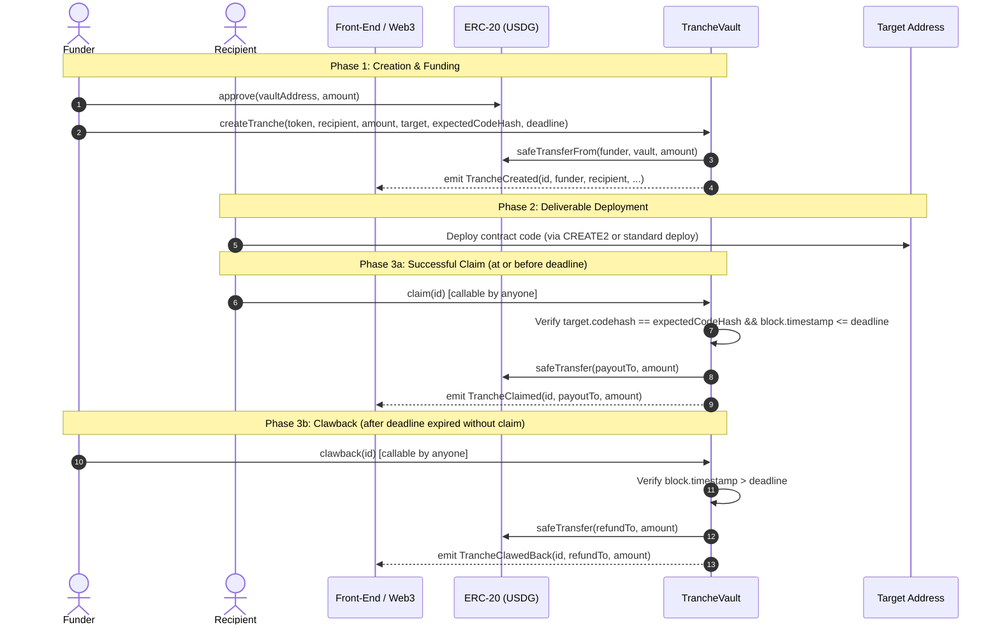

# Tranche Protocol — Front-End Integration Guide

This document describes how front-end applications and offchain agents integrate with the Tranche escrow protocol.

---

## 1. Network Deployments & ABIs

Do **not** hardcode contract addresses into application source code. Dynamic addresses and chain configurations should be loaded directly from the respective deployment manifests:

- **Robinhood Testnet (Chain ID `46630`)**: [`deployments/46630.json`](../deployments/46630.json)
- **Arbitrum Sepolia (Chain ID `421614`)**: [`deployments/421614.json`](../deployments/421614.json)
- **Contract ABI**: [`abi/TrancheVault.json`](../abi/TrancheVault.json)

> **Important**: The `token` passed to `createTranche` must be a supported ERC-20 token address defined in the target chain's deployment file (`deployments/<chainId>.json`). Fee-on-transfer and rebasing tokens are explicitly not supported and will revert.

---

## 2. Decimals & Token Units

- The native settlement currency (USDG / MockUSDG) uses **6 decimals**.
- Front-ends must format token units accordingly:
  - $1.00 USDG = `1_000_000` (`10^6`)
  - $100.00 USDG = `100_000_000`
  - $0.50 USDG = `500_000`
- Values in parameters (`amount`) are typed as `uint128`.

---

## 3. Workflow & Call Order



### Step 1: Token Approval
Before creating a tranche, the funder must grant an allowance to the vault:
```javascript
await usdgContract.approve(vaultAddress, amount);
```

### Step 2: Create Tranche
The funder invokes `createTranche`:
```javascript
const tx = await vaultContract.createTranche(
  tokenAddress,       // address: ERC-20 token address from deployments/<chainId>.json
  recipientAddress,   // address: beneficiary
  amount,             // uint128: token amount in 6 decimals (e.g. 100_000_000 for 100 USDG)
  targetAddress,      // address: pre-committed target deployment address
  expectedCodeHash,   // bytes32: runtime keccak256 hash of expected deliverable bytecode
  deadlineUnix        // uint64: absolute unix timestamp cutoff (must be > current block timestamp)
);
const receipt = await tx.wait();
// Read `id` from TrancheCreated event
```

### Step 3: Deploy Deliverable
The recipient deploys the contract code to `targetAddress`. The deployed runtime bytecode hash (`target.codehash`) must exactly match `expectedCodeHash`.

### Step 4: Settlement (Claim, Clawback, or Decline)

#### Claim (`claim(uint256 id)`)
- **Who can call**: Anyone (publicly callable).
- **Condition**: Tranche is `Active`, `block.timestamp <= deadline`, and `target.codehash == expectedCodeHash`.
- **Destination**: Tokens are transferred to `payoutTo` (defaults to `recipient`).

#### Clawback (`clawback(uint256 id)`)
- **Who can call**: Anyone (publicly callable).
- **Condition**: Tranche is `Active` and `block.timestamp > deadline`.
- **Destination**: Tokens are transferred to `refundTo` (defaults to `funder`).

#### Decline (`decline(uint256 id)`)
- **Who can call**: Only the original `recipient`.
- **Condition**: Tranche is `Active` (can be called at any time, before or after deadline).
- **Destination**: Tokens are immediately returned to `refundTo`.

### Optional: Redirection of Payout / Refund Addresses
If an address becomes compromised or frozen (e.g., USDG address freezing):
- **Recipient** can call `setPayoutTo(uint256 id, address newPayoutTo)` while `Active`.
- **Funder** can call `setRefundTo(uint256 id, address newRefundTo)` while `Active`.

---

## 4. Deadline Semantics

- **Strict Boundary**:
  - `block.timestamp <= deadline`: `claim(id)` is **allowed** (assuming code hash matches).
  - `block.timestamp == deadline`: `claim(id)` is **allowed**; `clawback(id)` will **revert** (`DeadlineNotPassed`).
  - `block.timestamp > deadline`: `claim(id)` will **revert** (`DeadlinePassed`); `clawback(id)` is **allowed**.
- Deadlines are unix timestamps in seconds.

---

## 5. View Functions for Front-End Display

Front-ends can query status and UI state without sending transactions:

### `getTranche(uint256 id) returns (Tranche memory)`
Returns the full tranche struct. Reverts with `TrancheNotFound()` if `id` does not exist.
```solidity
struct Tranche {
    address funder;
    address recipient;
    address token;
    uint128 amount;
    address target;
    bytes32 expectedCodeHash;
    uint64 deadline;
    Status status;      // 0: None, 1: Active, 2: Claimed, 3: ClawedBack, 4: Declined
    address payoutTo;
    address refundTo;
}
```

### `isClaimable(uint256 id) returns (bool)`
Returns `true` if and only if:
- `status == Status.Active`
- `block.timestamp <= deadline`
- `target.codehash == expectedCodeHash`
Returns `false` otherwise (never reverts, even for invalid IDs).

### `isClawbackable(uint256 id) returns (bool)`
Returns `true` if and only if:
- `status == Status.Active`
- `block.timestamp > deadline`
Returns `false` otherwise (never reverts, even for invalid IDs).

---

## 6. Custom Errors

All custom errors declared in [`ITrancheVault.sol`](../src/interfaces/ITrancheVault.sol):

| Custom Error | Selector | Description |
|---|---|---|
| `ZeroAddress()` | `0xd92e233d` | A required address parameter (`token`, `recipient`, `target`, `addr`) was `address(0)`. |
| `ZeroAmount()` | `0x1f2a2005` | The `amount` parameter was 0. Must be greater than 0. |
| `ZeroCodeHash()` | `0x032e5197` | The `expectedCodeHash` parameter was `bytes32(0)`. |
| `ForbiddenCodeHash()` | `0x021f7dc1` | `expectedCodeHash` equals `keccak256("")` (`0xc5d2460186f7233c927e7db2dcc703c0e500b653ca82273b7bfad8045d85a470`), matching empty accounts/EOAs. |
| `DeadlineNotFuture()` | `0x7f31cc85` | `deadline <= block.timestamp` during `createTranche`. Deadline must be strictly in the future. |
| `TargetAlreadyDeployed()` | `0x2e896af6` | `target.code.length != 0` at creation time. Target address already has bytecode. |
| `AmountMismatch()` | `0x55e97b0d` | Actual balance delta after `transferFrom` did not match `amount`. Fee-on-transfer tokens rejected. |
| `NotActive()` | `0x4065aaf1` | Action attempted on a tranche whose status is not `Active` (e.g. already claimed, clawed back, or declined). |
| `DeadlinePassed()` | `0x387b2e55` | `claim` attempted when `block.timestamp > deadline`. |
| `DeadlineNotPassed()` | `0x02eb3543` | `clawback` attempted when `block.timestamp <= deadline`. |
| `Unauthorized()` | `0x82b42960` | Caller is not authorized for the action (e.g. non-recipient calling `decline` or `setPayoutTo`, non-funder calling `setRefundTo`). |
| `BytecodeMismatch()` | `0xd0d8722b` | Bytecode hash at `target` does not equal `expectedCodeHash` during `claim`. |
| `TrancheNotFound()` | `0xb54ae23f` | `getTranche` queried for an uncreated or zero tranche ID. |

---

## 7. Events

All events declared in [`ITrancheVault.sol`](../src/interfaces/ITrancheVault.sol):

### `TrancheCreated`
Emitted upon creation. Contains all parameters necessary to reconstruct contract state offchain.
```solidity
event TrancheCreated(
    uint256 indexed id,
    address indexed funder,
    address indexed recipient,
    address token,
    uint128 amount,
    address target,
    bytes32 expectedCodeHash,
    uint64 deadline
);
```

### `TrancheClaimed`
Emitted when a tranche is successfully claimed.
```solidity
event TrancheClaimed(
    uint256 indexed id,
    address indexed payoutTo,
    uint128 amount
);
```

### `TrancheClawedBack`
Emitted when an expired tranche is clawed back.
```solidity
event TrancheClawedBack(
    uint256 indexed id,
    address indexed refundTo,
    uint128 amount
);
```

### `TrancheDeclined`
Emitted when a recipient voluntarily declines an active tranche.
```solidity
event TrancheDeclined(
    uint256 indexed id,
    address indexed refundTo,
    uint128 amount
);
```

### `PayoutToUpdated`
Emitted when the recipient updates the payout destination.
```solidity
event PayoutToUpdated(
    uint256 indexed id,
    address indexed newPayoutTo
);
```

### `RefundToUpdated`
Emitted when the funder updates the refund destination.
```solidity
event RefundToUpdated(
    uint256 indexed id,
    address indexed newRefundTo
);
```

---

## 8. Demo Recipe

A complete end-to-end demonstration flow is implemented in [`script/DemoFlow.s.sol`](../script/DemoFlow.s.sol) and [`script/helpers/DemoDeliverable.sol`](../script/helpers/DemoDeliverable.sol).

The demo dynamically reads the vault and token contracts from `deployments/<chainId>.json` and contains three entry points:

### 8.1 Happy Path Flow: `run()`
Mints 100 MockUSDG (if mock token), approves TrancheVault, computes target deploy address from explicit transaction nonce, creates a tranche with `deadline = block.timestamp + 1 hours`, deploys `DemoDeliverable`, verifies `address(deployed) == target`, and claims the locked funds.

```bash
# Robinhood Testnet (Chain ID 46630)
forge script script/DemoFlow.s.sol:DemoFlow --rpc-url https://rpc.testnet.chain.robinhood.com --broadcast

# Arbitrum Sepolia (Chain ID 421614)
forge script script/DemoFlow.s.sol:DemoFlow --rpc-url https://sepolia-rollup.arbitrum.io/rpc --broadcast
```

### 8.2 Expiring Tranche Creation: `createExpiring()`
Mints 100 MockUSDG (if mock token), approves TrancheVault, and creates an escrow tranche with a short deadline of `block.timestamp + 180 seconds` (3 minutes). No contract is deployed to the target address, leaving the tranche unclaimed.

```bash
# Robinhood Testnet (Chain ID 46630)
forge script script/DemoFlow.s.sol:DemoFlow --sig "createExpiring()" --rpc-url https://rpc.testnet.chain.robinhood.com --broadcast

# Arbitrum Sepolia (Chain ID 421614)
forge script script/DemoFlow.s.sol:DemoFlow --sig "createExpiring()" --rpc-url https://sepolia-rollup.arbitrum.io/rpc --broadcast
```

### 8.3 Clawback Expired Tranche: `clawbackExpired()`
After the 180-second deadline has elapsed, anyone can call `clawback(id)` to return the 100 USDG back to the funder's `refundTo` address. Specify the target tranche ID using the `DEMO_ID` environment variable:

```bash
# Robinhood Testnet (Chain ID 46630)
DEMO_ID=<trancheId> forge script script/DemoFlow.s.sol:DemoFlow --sig "clawbackExpired()" --rpc-url https://rpc.testnet.chain.robinhood.com --broadcast

# Arbitrum Sepolia (Chain ID 421614)
DEMO_ID=<trancheId> forge script script/DemoFlow.s.sol:DemoFlow --sig "clawbackExpired()" --rpc-url https://sepolia-rollup.arbitrum.io/rpc --broadcast
```

